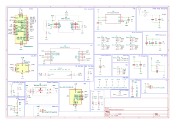

# MarshGazers

## Brief
I worked in a team of 10 to create a Mars Rover for the 2026 UK SEDS ORTS competition. Our entry won best CDR, which translates to the best design.

I was on the autonomy team, but my main contribution was the final electrical subsystem, most notably the control and power delivery PCB as well as the low level firmware.

## Mission Statement
The 2026 Mission was a soil sampling mission: your rover must go to 3 sites and collect sand samples from the ground, returning the samples to a collection point. There is a 30 minute total time limit, and manual interventions such as re-righting the robot, repairs, etc are all points deductions.
An additional challenge was to achieve the highest level of autonomy possible. In this case we chose to attempt full autonomy.

## General design

## Electrical Subsystem

### Phase 1 - Perfboard and General Requirements
The initial electronics design was laid out by my teammate, who worked on the electronics that we used for the majority of our prototypes. The requirements for our electronics system are a few fold:
- Take power from 12V 3S LiPo battery
- Power an NVidia Jetson Orin
- Power up and control up to 6 ST3020 servo motors simultaneously
- Kill switch for instant power off

These 4 requirements are all we need to get our mission completed successfully. The initial electronics system therefore was made up of:
- FPV drone power delivery board
- Arduino Giga R1 Wifi
- 2 Waveshare ESP32 motor driver modules
- 6 ST3020 Servo motors
- Kill switch
- Nvidia Jetson Orin Nano

We powered the Jetson through the wall for this setup. There was also an additional perfboard that acted as a power rail.

This system worked fine, but had cables everywhere. The mechanical team attempted to design 2 versions of the enclosure, one with the initial setup, and one provisioned for the "to be determined" PCB, but it ended up that with all of the components above, only a small form factor PCB would be able to do the job.

### Phase 2 - PCB requirements
The requirements here are much greater, as we are doing more work from scratch:
- Control 6 ST3020 Servo Motors
- Power Jetson Orin Nano through battery supply
- Kill switch for instant power off
- Step down 12V to 3.3V logic for low level controller
- Micro ROS node for low level control
- auxiliary IMU on low level controller
- Smooth voltage spikes for power delivery
- Provide 2 communication channels between MCU and Jetson

The other main factor I had to consider was dimensions, as this had to be compact enough to fit in the small, lower compartment of our chassis. I ended up with a dimension of 60x41mm, so slightly smaller than an Arduino Uno form factor. As it turns out, the board could have been doubled in size.

For the purposes of ease of design, manufacture and repairability, I chose to go for a 4 layer board with single sided assembly.

### Phase 3 - PCB schematic capture

I begin the circuit design by going in reverse from the end goal. The requirements state we need to drive 6 ST3020 Servo motors, talk to the Jetson by 2 robust methods, run MicroROS and talk to an IMU.

Starting with the servos, we need to look at how they are driven. According to [WaveShare site](https://www.waveshare.com/wiki/ST3020_Servo?srsltid=AfmBOorIegTQRR6WXdnMb1lv5_sHYj1AtUHmExvoQsjfnhRMfnpFB-jI) these servos have their own drivers internally, and simply receive commands over a shared half-duplex (Tx only) UART bus. Servos have 8 bit IDs, so up to 253 can be chained together on the same bus for signal. This makes our lives easier, as we can use a single UART Tx pin for sending signals to all of our motors. Our MCU therefore will need 1 UART Tx pin.

Next we look at communication. The gold standard for communication between modules in autonomous, especially driving systems is CAN bus. This stands for Controller Area Network. It is great for 2 main reasons: it is simple, and it is robust. CAN bus only needs 2 wires in a differential pair, and many devices can all talk on the same bus so it is easily hot pluggable. Being a differential pair, with a twisted pair of wires we get a very robust connection which is able to handle more external noise without corrupting our signal. This is our primary connection. This means we need some kind of CAN transciever module, as well as CAN_FD pins on our MCU.
The Nvidia Jetson has support for CAN bus, although headers are not soldered by default and it also requires an external transciever.

Our fallback will be a UART connection. This comes with 2 benefits: "OTA" programming as well as our communication channel. The Jetson has UART headers exposed in its 40 pin header, so it is easy to wire up. You can also program a microcontroller chip over serial interface, meaning that with the Jetson powered on and wired up to the controller, we can wirelessly communicate with the Jetson to program the MCU with firmware, even though the board itself doesn't have wireless connectivity.
This means we need an additional pair of UART Tx/Rx pins.

Finally, for our IMU we select an IMU with SPI communication (usually they also are dual-mode with I2C), although I2C is not as robust or fast of a connection, so we choose SPI. In this design it will make 0 difference however.

Then given the MicroROS requirement, we need an MCU that has at least 50kB of RAM to provide enough heap space for MicroROS with any other firmware memory.

This led me to the choice of the STM32G4A1KEU6. This is probably the smallest, lowest powered STM32 chip that supports MicroROS, with Arm M4 Cortex core at 170MHz clock. It comes in a smallest package of 32-UFQFPN which is what we chose to use, being 5mmx5mm. It has multiple UART, SPI, and CAN_FD peripherals, which means it supports all of our requirments, and gives us a good number of pins in a very small form factor. The cost for this part was about £5 at the time of manufacture.

### Phase 4 - PCB layout design

 

### Phase 5 - DFM check and manufacture

### Phase 6 - Verification

### Phase 7 - Final firmware

## Engineering Analysis

### Successes
The board worked perfectly. There was never any need for a v2 and besides one accidental board destruction (not from design), the final board completed the mission objectives and stayed intact and functioning even after a pyroshock test (simulating the effect of rover entering orbit in spacecraft).

### Improvements to make
#### Connector polarity

#### Connector choice

#### Full spice simulation
